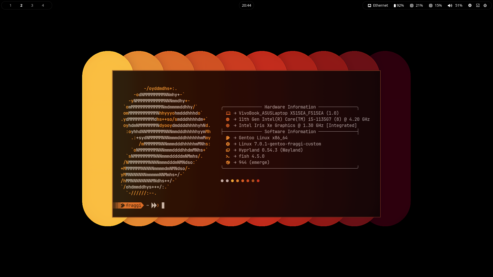
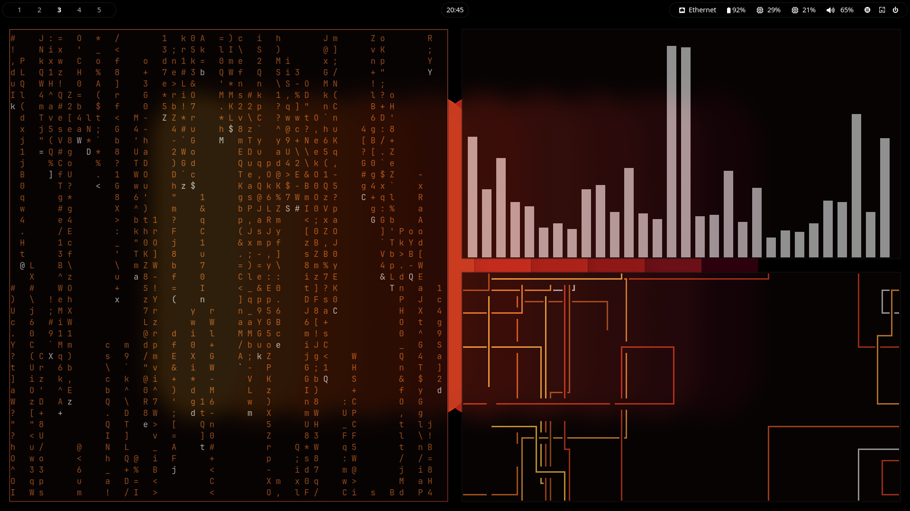

# My hyprland dotfiles
My dotfiles for gentoo

## Gallery

## Directories
hypr .config/hypr/  (here you have hyprland.conf and hyprlock.conf)

waybar .config/waybar/ (here you have the config file and the css file)

waybar scripts .config/waybar/scripts (all the waybar scripts)

wofi .config/wofi (style.css and wall.css files)

pywal .config/wal/templates (add here the color templates for hyprland and wofi) (rofi too if you use it)

Wallpapers ~/Pictures/Wallpapers 

fish .config/fish (config.fish file for the aliases etc...)

kitty .config/kitty (kitty config file)

starship .config/starship.toml (this is the config file)
